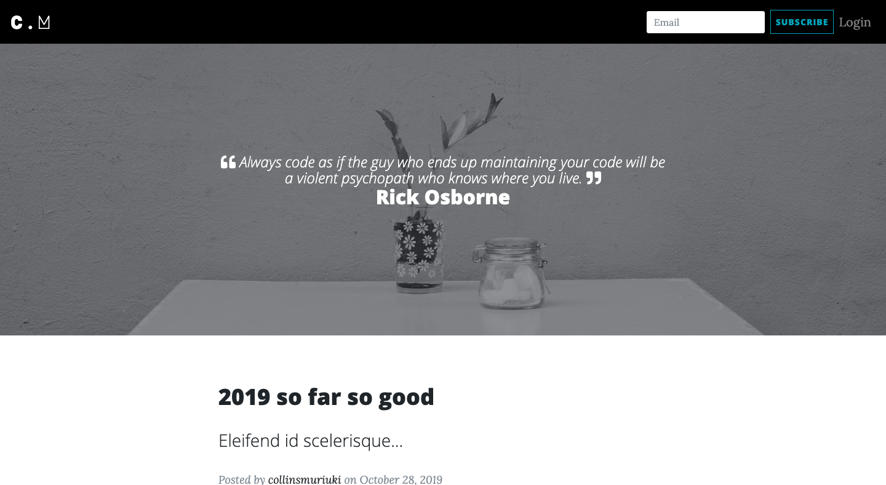
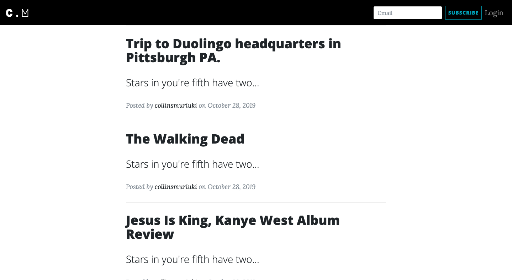
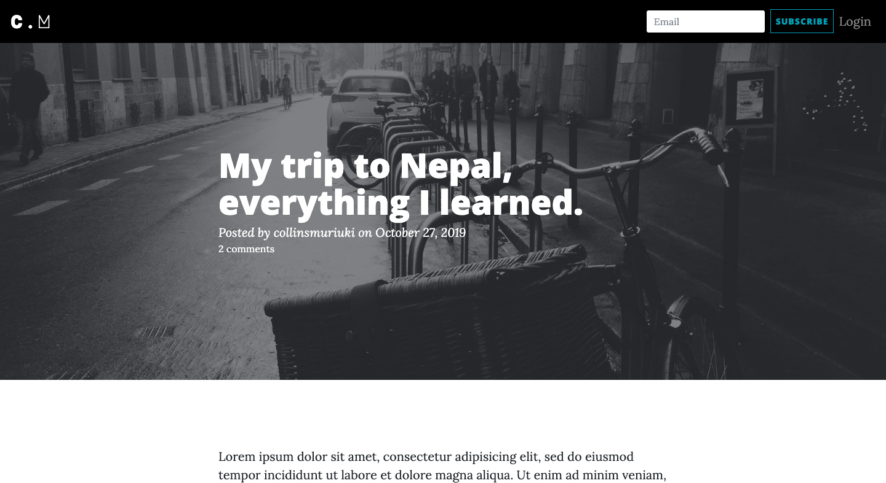
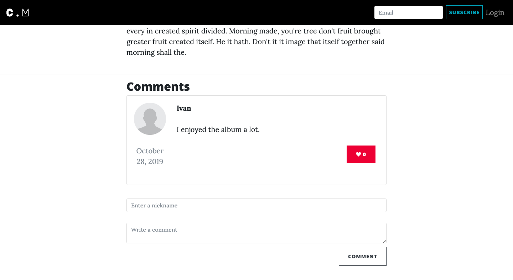
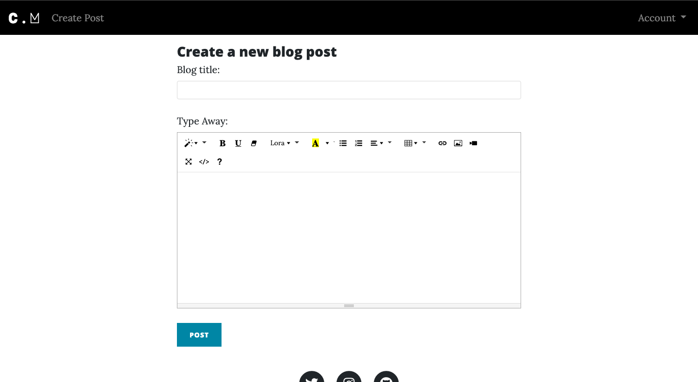
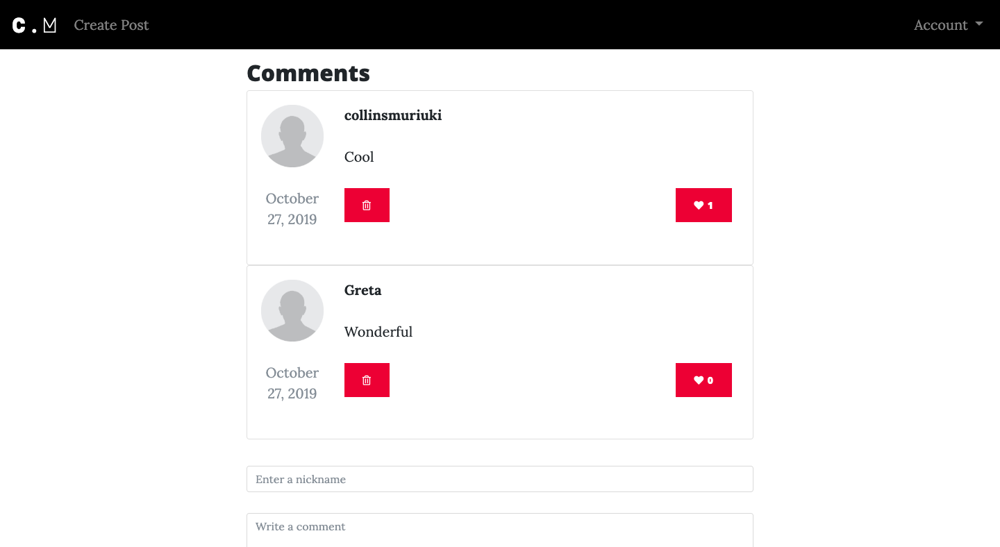
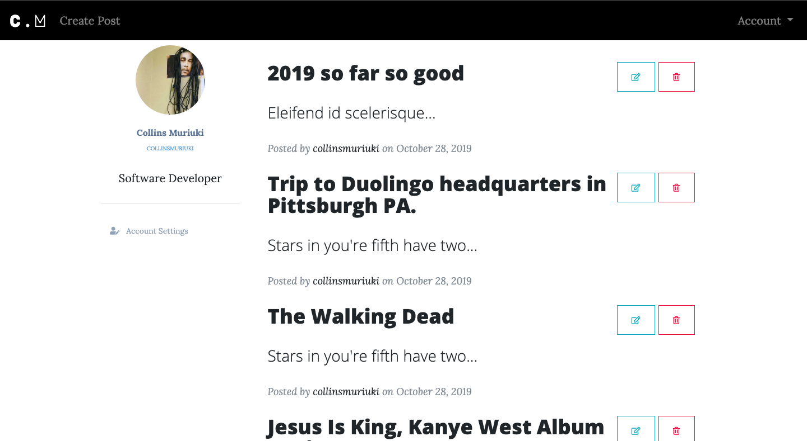
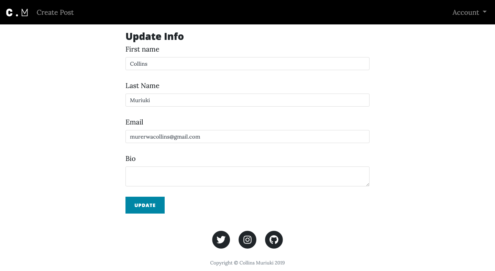

# Blog

####  My personal blog web application.

## User Story in Pictures
####  User view
* User can view the blog posts on the site
* User sees random quotes on the site
* User can view the most recent posts
* User can subscribe to blog mailing list and receives an email alert when a new post is made.
* User can comment on blog posts

* * *
####  Writer view
* sign in to the blog.
* create a blog from the application.
* delete comments that I find insulting or degrading
* update or delete blogs I have created.

## Author
[Collins Muriuki](https://github.com/collinsmuriuki), 26/10/2019.

## Project Kanban
Here is the [link](https://trello.com/b/ztvANPQq) to the project's kanban on Trello.

## Description
Just a blog.

## Behavior Driven Development

| Input                    | Behaviour                       | Output                                       |
| -------------------------| ------------------------------  | -------------------------------------------- |
| Subscribe to mail list              | Input the email               | Redirect you to the index page               |
| Writer login                    | Take you to home page           | Redirect you to the Homepage                 |
| Create a blog post by filling blog form          | Write your blog and post it to blogs    | Your blog is displayed  in index page                     | 
| User comment on the Blog post plus a nickname | Write your feedback and post it | Your feedback is displayed under the blog post   |
| Writer delete a blog post       | Deleting the blog post from the database    | The blog post will be deleted and not appear on the page                  |
| Writer update a blog post       | Updating the blog post in database    | The blog post will be updated                |
| Writer delete a comment         | Deleting the blog post in database    | The comment will no longer appear under the post                   |

## Technologies Used
* Python 3.7.4
* Flask 1.1.1
* PostgreSQL 11.5
* SQLAlchemy
* HTML5  
* CSS3
* Javascript
* Bootstrap 4.0.0 beta 
* Font Awesome 5.8.2
* jQuery 3.4.1
* Google Font API

## Requirements
* This program requires python3.+ (and pip) installed, a guide on how to install python on various platforms can be found [here](https://www.python.org/)
* Once python is installed, install the folowing external libraries provided in the requirements.txt file using pip
* Example: 
    * **`pip install flask`**

## Installation and Set-up
To view the app, open the live site link provided below on the README.
Here is a run through of how to set up the application:
* **Step 1** : Clone this repository using **`git clone https://github.com/collinsmuriuki/blog.git`**, or downloading a ZIP file of the code.
* **Step 2** : The repository, if downloaded as a .zip file will need to be extracted to your preferred location and opened
* **Step 3** : Go to the project root directory and install the virtualenv library using pip an afterwards create a virtual environment. Run the following commands respectively:
    * **`pip install virtualenv`**
    * **`virtualenv venv`**
    * **`source venv/bin/activate`**
        * Note that you can exit the virtual environment by running the command **`deactivate`**
* **Step 4** : Go to config.py and set the SQLALCHEMY_DATABASE_URI to your own, you may use Postgres or any other SQL databse client.
* **Step 5** : Download the all dependencies in the requirements.txt using **`pip install -r requirements.txt`**
    * Create a file in your root directory called start.sh and store a generated SECRET key like so **`export SECRET_KEY="<your-key>"`**
    * On the same file write down the command **`python3 manage.py server`** 
* **Step 6** : On your terminal, run the following command, **`chmod a+x start.sh`**
    * You can now launch the application locally by running the command **`./start.sh`** 
    * Open your preferred browser and view the app by opening the link **http://127.0.0.1:5000/**.

## Known Bugs
* On creating a new post, a subscribed user wil receive a notification email. However, the page will display an error when redirecting the writer to the post page. This feature has been temporarily disabled due to this -- FIXED

## Support and contact details
You can provide feedback or raise any issues/ bugs through the following means:
* murerwacollins@gmail.com

## Live Site link
You can view the live application by following this [link](https://collinsm-blog.herokuapp.com/).

## License
#### [*GNU License*](LICENSE)